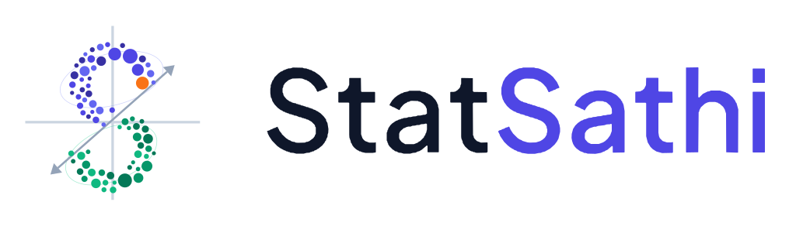
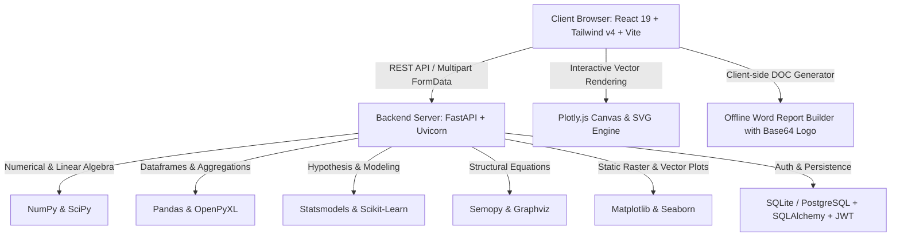

# 📊 StatSathi — Your Research Analytics Companion

<div align="center">
  
  <p><strong>A Modern, High-Precision Web Platform for Statistical Modeling, Agricultural Field Experiments & Publication-Grade Research Analytics</strong></p>
  <p><em>Curated by Ravi, PhD Scholar, ICAR-IISS (Indian Institute of Soil Science), Bhopal</em></p>

  [](https://github.com/rav054/statsathi-frontend)
  [](https://vitejs.dev/)
  [](https://fastapi.tiangolo.com/)
  [](https://plotly.com/javascript/)
  [](#)
</div>

---

## 📑 Table of Contents

1. [Executive Summary & Core Philosophy](#-1-executive-summary--core-philosophy)
2. [Platform Architecture & Tech Stack](#-2-platform-architecture--tech-stack)
3. [Are the Plots Simple? (Dual-Tier Visualization Engine)](#-3-are-the-plots-simple-dual-tier-visualization-engine)
4. [Master Catalog of Color Palettes Across Modules](#-4-master-catalog-of-color-palettes-across-modules)
5. [In-Depth Breakdown of All 12 Statistical Modules](#-5-in-depth-breakdown-of-all-12-statistical-modules)
   - [5.1 Field Layout Generator (Experimental Design)](#51-field-layout-generator-experimental-design)
   - [5.2 Data Transformation & Feature Scaling](#52-data-transformation--feature-scaling)
   - [5.3 Descriptive Statistics & Quality Diagnostics](#53-descriptive-statistics--quality-diagnostics)
   - [5.4 Plots & Visualizations (Publication Suite)](#54-plots--visualizations-publication-suite)
   - [5.5 Correlation Analysis (Full vs. Half Matrices)](#55-correlation-analysis-full-vs-half-matrices)
   - [5.6 Parametric Hypothesis Testing](#56-parametric-hypothesis-testing)
   - [5.7 Non-Parametric Hypothesis Testing](#57-non-parametric-hypothesis-testing)
   - [5.8 ANOVA — Design of Experiments (DoE) & Post-Hoc Separation](#58-anova--design-of-experiments-doe--post-hoc-separation)
   - [5.9 Regression Modeling (OLS & PLSR)](#59-regression-modeling-ols--plsr)
   - [5.10 PCA — Principal Component Analysis](#510-pca--principal-component-analysis)
   - [5.11 Clustering & Spatial Risk Zoning](#511-clustering--spatial-risk-zoning)
   - [5.12 Structural Equation Modeling (SEM) & Path Analysis](#512-structural-equation-modeling-sem--path-analysis)
6. [Comprehensive Statistical Measures Matrix](#-6-comprehensive-statistical-measures-matrix)
7. [Word (.doc) Report Generation Engine](#-7-word-doc-report-generation-engine)
8. [Data Management, In-Browser Spreadsheet & Converter](#-8-data-management-in-browser-spreadsheet--converter)
9. [Learning Hub & Research Encyclopedia](#-9-learning-hub--research-encyclopedia)
10. [Brand System & Dynamic Light/Dark Mode](#-10-brand-system--dynamic-lightdark-mode)
11. [Installation, Local Development & Deployment](#-11-installation-local-development--deployment)
12. [Author & Institutional Credits](#-12-author--institutional-credits)

---

## 🏛️ 1. Executive Summary & Core Philosophy

**StatSathi** (*Stat* + *Sathi*, meaning *"Companion"* or *"Partner"* in Sanskrit and Hindi) was conceived, engineered, and curated by **Ravi**, PhD Scholar at the **ICAR-Indian Institute of Soil Science (IISS), Bhopal**. It bridges the critical divide between daunting command-line statistical software (R, SAS, Python) and the cumbersome, error-prone manual spreadsheets of everyday researchers.

StatSathi is engineered specifically to meet the publication criteria of top-tier international scientific journals (Elsevier, Springer, Nature, Wiley, Frontiers, ICAR institutes). Whether calculating **Critical Difference (CD/LSD)** values for multi-factor field agronomy trials, resolving collinear spectral bands with **Partial Least Squares Regression (PLSR)**, estimating complex construct paths via **Structural Equation Modeling (SEM)**, or generating randomized field planting grids, StatSathi delivers **instant mathematical rigor, interactive diagnostic feedback, and publication-ready Word and Vector artifacts**.

### 🌟 Key Pillars
- **Zero Coding Barrier**: Perform multivariate statistics and experimental designs through an intuitive, reactive UI.
- **Agricultural & Life Sciences Optimization**: Specialized layout generators, multi-factor ANOVA interaction grids, Duncan's DMRT significance letters, and chemometric spectral transformations.
- **Publication-Ready Exports**: 300 to 600 DPI vector SVGs, high-density PNGs, and Microsoft Word (.doc) reports with embedded logos and APA-compliant tables.
- **Interactive Data Inspection**: Integrated in-browser spreadsheet editor (`DatasetViewerModal`) allowing real-time cell editing, sorting, column manipulation, and outlier verification.
- **Dual-Theme Brand Experience**: Full light and dark mode with persistent state, SVG logo adaptation, and WCAG-compliant high-contrast academic typography.

---

## ⚡ 2. Platform Architecture & Tech Stack



### 💻 Frontend Architecture
- **Framework**: React 19 (`react`, `react-dom` 19.2.6) with functional hooks and React Portals.
- **Bundler & Tooling**: Vite 8.0 with Hot Module Replacement (HMR) compiling production assets in under 3.5 seconds.
- **Styling & CSS**: Tailwind CSS v4 (`@tailwindcss/vite` 4.3.0) with custom `@theme` variables (`--color-brand-indigo: #4F46E5`, `--color-brand-orange: #F97316`).
- **Interactive Graphics**: Plotly.js (`plotly.js-dist-min` 3.6.0) enabling dynamic pan, zoom, hover data inspection, and box selection.
- **Icons**: Lucide React (`lucide-react` 1.17.0).

### ⚙️ Backend Architecture
- **Framework**: FastAPI 0.100+ with asynchronous request routing and CORS middleware.
- **Server**: Uvicorn ASGI server with multi-worker scaling.
- **Scientific Computing**: NumPy 1.24+, SciPy 1.10+, Pandas 2.0+, Statsmodels 0.14+.
- **Machine Learning**: Scikit-Learn 1.2+ (K-Means, PCA, PLSRegression, PowerTransformer, StandardScaler, MinMaxScaler).
- **SEM Engine**: `semopy` 2.3+ with Graphviz diagram generation.
- **Security & Storage**: Passlib (Bcrypt), Python-JOSE (JWT tokens), SQLAlchemy 2.0 ORM with SQLite/PostgreSQL support.

---

## 🎨 3. Are the Plots Simple? (Dual-Tier Visualization Engine)

> **NO, the plots provided in StatSathi are NOT simple static pictures.**  
> StatSathi implements a sophisticated **Dual-Tier Visualization Engine** that combines **live web interactivity** with **ultra-high-resolution publication-grade vector rendering**.

```
┌──────────────────────────────────────────────────────────────────────────────────┐
│                             DUAL-TIER PLOT ARCHITECTURE                          │
├──────────────────────────────────────────┬───────────────────────────────────────┤
│    TIER 1: Interactive Web Canvas        │    TIER 2: Publication Vector Engine  │
├──────────────────────────────────────────┼───────────────────────────────────────┤
│ • Dynamic hover tooltips (exact values)  │ • 300 to 600 DPI rasterization (PNG)  │
│ • Real-time box-zoom & axis panning      │ • Lossless Vector SVG for print       │
│ • Lasso & rectangular sample selection   │ • Custom typography (8pt to 24pt)     │
│ • Click-to-isolate legend series         │ • Custom axis limits (Xmin, Xmax)     │
│ • Double-click auto-rescaling            │ • Custom tick intervals & grid lines  │
│ • Powered by Plotly.js                   │ • Error bars (SD, SE, 95% CI)         │
│ • Zero latency client-side manipulation  │ • Shaded confidence bands & hulls     │
└──────────────────────────────────────────┴───────────────────────────────────────┘
```

### Why StatSathi Plots Surpass Basic Plotting Tools:
1. **Interactive Hover Tooltips**: Hovering over any point, bar, whisker, or dendrogram node reveals exact numerical coordinates, sample IDs, $p$-values, treatment means, and significance groupings.
2. **Significance Letter Annotations**: ANOVA post-hoc comparison bar charts automatically render compact letter displays (e.g., `a`, `ab`, `b`, `c`) directly above error whiskers according to Critical Difference (CD) thresholds.
3. **Cluster Convex Hull Boundary Clouds**: In Clustering analysis, 2D observation scatters are enveloped in semi-transparent (9% opacity) shaded convex hull polygon "clouds" with distinctive star centroid markers for each cluster.
4. **Diagnostic Overlay Curves**:
   - Histograms feature selectable **Kernel Density Estimation (KDE)** normal curve overlays.
   - Scatter plots feature selectable **Linear Regression Trendlines** with 95% confidence intervals.
   - Normal Q-Q plots feature theoretical **45-degree reference lines** to immediately assess skewness and heavy tails.
   - Regression models feature a **Predicted vs. Actual diagnostic scatter plot** with a 1:1 reference line ($Y = X$).
5. **Full Typography & Layout Control**:
   - Font sizes for Title (10–24pt), Axis Labels (8–18pt), and Ticks (6–14pt).
   - Font family selection: `sans-serif` (Inter/Helvetica), `serif` (Times New Roman for journals), or `monospace` (Consolas/Courier).
   - Dimension aspect ratios: Standard (4:3), Wide Cinema (16:9), or Square (1:1).
   - Legend placement options: `best`, `upper right`, `upper left`, `lower right`, `lower left`, `center right`, or `outside`.
6. **Lossless Scalable Vector Graphics (SVG)**: Every plot can be downloaded as a vector `.svg` file. This means researchers can open the figures in Adobe Illustrator, Inkscape, or Microsoft PowerPoint and edit labels, lines, and colors without any pixelation or loss of quality.

---

## 🌈 4. Master Catalog of Color Palettes Across Modules

StatSathi provides extensive, mathematically curated color palettes designed for visual appeal, accessibility (colorblind-friendly options), and strict academic journal standards:

### 1. Correlation Heatmap Palettes (10 Curated Maps)
| Palette Key | Palette Name | Color Gradient & Character | Best Academic Use Case |
|---|---|---|---|
| `YlOrRd` | **Classic Thermal** | Yellow $
ightarrow$ Orange $
ightarrow$ Red | Soil nutrient concentrations, temperature, agronomic yields |
| `YlGnBu` | **Classic Aquatic** | Light Yellow $
ightarrow$ Green $
ightarrow$ Deep Blue | Hydrology, plant chlorophyll, moisture indices |
| `coolwarm` | **Divergent Red-Blue** | Pure Blue ($-1$) $
ightarrow$ White ($0$) $
ightarrow$ Pure Red ($+1$) | Standard bipolar correlation matrices showing positive vs negative |
| `RdBu_r` | **Classic Red-White-Blue** | Rich Red ($-1$) $
ightarrow$ Crisp White ($0$) $
ightarrow$ Rich Blue ($+1$) | Peer-reviewed journal publications (Nature/Elsevier standard) |
| `inferno` | **Inferno Thermal Flame** | Black $
ightarrow$ Purple $
ightarrow$ Orange $
ightarrow$ Bright Yellow | High-contrast thermal imaging and dense matrices |
| `plasma` | **Plasma Thermal** | Deep Violet $
ightarrow$ Magenta $
ightarrow$ Warm Gold | Perceptually uniform color scale for continuous coefficients |
| `viridis` | **Viridis Sequential** | Dark Purple $
ightarrow$ Teal $
ightarrow$ Bright Green $
ightarrow$ Yellow | Colorblind-safe, black-and-white print readable standard |
| `magma` | **Magma Purple-Pink** | Obsidian Black $
ightarrow$ Plum $
ightarrow$ Rose $
ightarrow$ Cream | Highlighting hot-spots and extreme positive associations |
| `Spectral` | **Spectral Rainbow** | Red $
ightarrow$ Orange $
ightarrow$ Yellow $
ightarrow$ Green $
ightarrow$ Violet | Multi-band environmental diversity and broad-range variations |
| `vlag` | **Divergent Blue-Red** | Muted Blue $
ightarrow$ Neutral Grey $
ightarrow$ Muted Red | Subtle, publication-grade divergent contrast without eye strain |

### 2. General Plots & Visualizations (17 Curated Themes)
- `sunset`: Sunset Orange (Default StatSathi Brand Accent: `#F97316`)
- `indigo`: Deep Indigo Blue (StatSathi Brand Primary: `#4F46E5`)
- `teal`: Vibrant Teal Green (`#0D9488`)
- `crimson`: Intense Crimson Red (`#E11D48`)
- `charcoal`: Charcoal & Slate Greys (`#334155`)
- `emerald`: Agricultural Field Green (`#059669`)
- `amber`: Golden Amber (`#D97706`)
- `rose`: Gentle Rose Pink (`#F43F5E`)
- `skyblue`: Clear Atmospheric Sky Blue (`#0284C7`)
- `forest`: Deep Organic Forest Green (`#166534`)
- `navy`: Midnight Academic Navy (`#1E3A8A`)
- `spring`: Fresh Spring Breeze (Mint, Peach, Sky)
- `summer`: Warm Summer Heat (Yellow, Coral, Gold)
- `autumn`: Autumn Harvest (Rust, Ochre, Amber)
- `winter`: Crisp Winter Ice (Frost Cyan, Periwinkle, Grey)
- `coolwarm`: Scientific Bipolar Gradient
- `viridis`: Scientific Perceptually Uniform Gradient

### 3. PCA Biplot Palettes (6 Multi-Class Gradients)
- `Oranges`: Agricultural Sunset Orange (Default)
- `Blues`: Ocean & Deep Sapphire Blue
- `Greens`: Botanical Forest Green
- `coolwarm`: Divergent Red-Blue contrast
- `Purples`: Deep Academic Purple
- `magma`: Magma Pink-Black contrast

### 4. Clustering & Spatial Risk Zoning Palettes (4 Multi-Class Palettes)
- `classic`: **Vibrant Academic (10 Distinct Colors)**: `#4F46E5` (Indigo), `#F97316` (Orange), `#10B981` (Emerald), `#EC4899` (Pink), `#8B5CF6` (Purple), `#F59E0B` (Amber), `#EF4444` (Red), `#06B6D4` (Cyan), `#84CC16` (Lime), `#64748B` (Slate).
- `ocean`: **Ocean Breeze**: Cyan, Sky Blue, Royal Blue, Deep Sea Navy.
- `pastel`: **Modern Pastel**: Soft Periwinkle, Peach, Mint Green, Lilac, Lemon.
- `slate`: **Moody Slate**: Monochromatic greys and dark slates for formal monochrome journals.

### 5. Descriptive Statistics Chart Themes (6 Coordinated Themes)
- `indigo`: Indigo Twilight (`#4F46E5` primary, `#818CF8` secondary, `#F97316` accent)
- `emerald`: Emerald Garden (`#059669` primary, `#34D399` secondary, `#D97706` accent)
- `ocean`: Ocean Breeze (`#0284C7` primary, `#38BDF8` secondary, `#F59E0B` accent)
- `autumn`: Autumn Gold (`#D97706` primary, `#FBBF24` secondary, `#EF4444` accent)
- `lavender`: Lavender Dusk (`#7C3AED` primary, `#C084FC` secondary, `#EC4899` accent)
- `slate`: Slate Stone (`#475569` primary, `#94A3B8` secondary, `#0EA5E9` accent)

### 6. Field Layout Generator Themes (5 Agronomic Styles)
- `sunset`: Sunset Orange bunds and blocks
- `emerald`: Lush Field Crop Green
- `ocean`: Irrigation Channel Blue
- `grey`: Clean Neutral Slate
- `nocolor`: Pure Black & White (Optimized for field printing on paper notebooks)

---

## 🔬 5. In-Depth Breakdown of All 12 Statistical Modules

---

### 5.1 Field Layout Generator (Experimental Design)
*Designed specifically for agricultural researchers, agronomists, plant breeders, and field experimenters.*

- **Supported Field Layouts**:
  1. **CRD (Completely Randomized Design)**: One-way homogeneous layout with random plot assignment.
  2. **RBD (Randomized Block Design / RCBD)**: Replicated blocking controlling for single-direction field soil fertility gradients.
  3. **Two-Factor CRD**: Factorial $A 	imes B$ completely randomized across experimental units.
  4. **Two-Factor RBD**: Factorial $A 	imes B$ blocked into uniform replication strips.
  5. **Split-Plot Design**: Two-level layering where Main Plots (Factor A, e.g., Irrigation/Tillage) contain nested Sub-Plots (Factor B, e.g., Fertilizer/Varieties).
  6. **Sub-Sub Plot Design**: Three-level hierarchical nesting ($A 	imes B 	imes C$).
  7. **Latin Square Design (LSD)**: Two-way blocking simultaneously controlling for perpendicular environmental gradients (Rows and Columns). Treatments occur exactly once per row and once per column.
- **Field Engineering & Visual Options**:
  - **Irrigation Channels & Walkways**: Toggleable water channels and footpaths between blocks.
  - **Agricultural Bunds (Levees)**: Thickness selection (`none`, `thin`, `thick`) representing earthen field boundaries.
  - **Color Styles**: Sunset, Emerald, Ocean, Grey, or Monochrome (for field clipboard printing).
  - **Font Styles**: Sans-Serif, Serif, or Monospace.
- **Outputs & Downloads**:
  - Scalable Vector Graphics (`.svg`) rendering crisp field boundaries.
  - High-resolution `.png` image.
  - Formatted Field Plan Table showing Block Number, Plot ID, Treatment Code, and Factor Levels.

---

### 5.2 Data Transformation & Feature Scaling
*Pre-processing engine to stabilize non-constant variance (heteroscedasticity), achieve residual normality, and prepare machine learning features.*

- **Transformation Methods (4 Specialized Categories)**:
  1. **Classical Variance-Stabilizing Transformations**:
     - `log10`: Common Logarithm $\log_{10}(X)$ or $\log_{10}(X + 1)$ for zero-handling.
     - `ln`: Natural Logarithm $\ln(X)$ or $\ln(X + 1)$.
     - `sqrt`: Square Root $\sqrt{X}$ or $\sqrt{X + 0.5}$ (standard for Poisson count data like insect counts or weed populations).
     - `arcsine`: Angular / Arcsine Square Root $rcsin(\sqrt{p})$ (essential for percentages and binomial proportion data like disease incidence $[0, 1]$).
     - `inverse`: Reciprocal transformation $1/X$.
  2. **Automated Power Transformations (Normality Optimizers)**:
     - `boxcox`: Optimal parameter $\lambda$ maximum-likelihood estimation for strictly positive values ($X > 0$).
     - `yeojohnson`: Extended power transformation supporting zero and negative values ($X \le 0$).
  3. **Feature Scaling & Machine Learning Normalization**:
     - `zscore`: Standard Scaler transforming variables to $\mu = 0, \sigma = 1$. Essential for PCA, Cluster Analysis, and Ridge/Lasso regressions.
     - `minmax`: Min-Max Scaling bounding features strictly to the range $[0, 1]$.
  4. **Spectral & Chemometric Preprocessing (Advanced Research Tier)**:
     - `snv`: Standard Normal Variate (row-wise spectrum normalization removing particle scatter and path-length drift in NIR/FTIR spectroscopy).
     - `msc`: Multiplicative Scatter Correction relative to an ideal reference spectrum.
     - `sg_smooth`: Savitzky-Golay Polynomial Smoothing filter.
     - `sg_1der`: Savitzky-Golay First Derivative (resolves baseline shifts and overlapping peak slopes).
     - `sg_2der`: Savitzky-Golay Second Derivative (removes linear drift and sharpens narrow absorption peaks).
- **Outputs & Statistical Measures**:
  - Side-by-side diagnostic summary showing Skewness, Kurtosis, and Shapiro-Wilk $p$-values **before** vs. **after** transformation.
  - Export transformed dataset as a ready-to-analyze CSV with informative column suffixes (e.g., `_Log10`, `_ZScore`, `_YeoJohnson`).

---

### 5.3 Descriptive Statistics & Quality Diagnostics
*Comprehensive univariate and bivariate exploratory data analysis.*

- **Summary Statistics Calculated**:
  - **Measures of Central Tendency**: Arithmetic Mean ($ar{X}$), Median (50th percentile), Mode (most frequent value).
  - **Measures of Dispersion**: Standard Deviation ($SD$), Variance ($s^2$), Standard Error of the Mean ($SE_m$), Minimum, Maximum, Total Range.
  - **Relative Variability**: Coefficient of Variation ($CV\% = rac{SD}{ar{X}} 	imes 100$).
  - **Percentiles & Quartiles**: 10th, 25th ($Q_1$), 50th (Median), 75th ($Q_3$), 90th percentiles, and Interquartile Range ($IQR = Q_3 - Q_1$).
  - **Distributional Shape**: Skewness (with Standard Error) and Kurtosis (with Standard Error).
  - **Sample Completeness**: Total Observations ($N$), Valid Non-Missing Count, Missing Value Count, and Missing Percentage.
  - **Automated Outlier Identification**: Flagged via Tukey's $1.5 	imes IQR$ fence rule and $Z$-score threshold ($|Z| > 3$).
- **Normality Hypothesis Tests**:
  - **Shapiro-Wilk Test**: Test statistic $W$ and exact $p$-value.
  - **Kolmogorov-Smirnov Test**: Test statistic $D$ and exact $p$-value.
  - **D'Agostino-Pearson Omnibus Test**: Combined skewness and kurtosis test.
- **Categorical Group-By Disaggregation**: Option to group any continuous variable across levels of a categorical factor (e.g., Yield grouped by Tillage Treatment).
- **Interactive Visualizations (Plotly)**:
  1. Interactive Histogram with normal distribution density curve overlay.
  2. Normal Q-Q Plot with 45-degree theoretical quantile reference line.
  3. Interactive Box Plot displaying median line, mean diamond, IQR box, whiskers, and individual jittered data points.

---

### 5.4 Plots & Visualizations (Publication Suite)
*A dedicated graphics studio producing publication-ready charts compliant with academic journal style guides.*

- **10 Core Plot Types**:
  1. **Box Plot**: Single or multi-variable distribution boxes, grouped by categorical Hue.
  2. **Histogram**: Frequency distribution with customizable bin counts and optional Kernel Density Estimation (KDE) curve.
  3. **Scatter Plot**: Bivariate scatter with optional Linear Regression Trendline and confidence bounds.
  4. **Line Plot / Trend Curve**: Sequential time-series or factorial lines with optional error bars ($SD$, $SE$, $95\% CI$).
  5. **Bar Chart**: Mean comparison bar plots with customizable error bars ($SD$, $SE$, $95\% CI$).
  6. **Violin Plot**: Full kernel probability density shapes combined with embedded box summaries.
  7. **Normal Q-Q Plot**: Quantile-Quantile plot against theoretical normal quantiles.
  8. **Pie Chart**: Proportional categorical slices with percentage labels.
  9. **Multi-Line Trend Series**: Simultaneous plotting of multiple numeric variables across a common X-axis.
  10. **PCA Biplot**: 2D projection of scores with superimposed eigenvector loading vectors.
- **Customization Options**:
  - Typography: Title, Label, and Tick font sizes and font families.
  - Colors: 17 curated palettes plus custom label text colors.
  - Axis Formatting: Manual X-axis and Y-axis limits ($X_{\min}, X_{\max}, Y_{\min}, Y_{\max}$) and tick intervals.
  - Error Bar Toggles: None, Standard Deviation ($SD$), Standard Error ($SE$), or 95% Confidence Interval ($CI$).
  - Grid: Toggle major and minor grid lines on or off.
- **Export**: PNG (up to 600 DPI) and vector SVG.

---

### 5.5 Correlation Analysis (Full vs. Half Matrices)

> **Does correlation have full matrix or half matrix?**  
> **StatSathi supports BOTH!** The user can choose between **Full Matrix**, **Lower Triangle Half Matrix**, or **Upper Triangle Half Matrix** directly from the UI dropdown before running the analysis or downloading reports.

```
Full Matrix (Square)          Half Plot (Lower Triangle)       Half Plot (Upper Triangle)
┌──────────┬──────────┬──────┐ ┌──────────┬──────────┬──────┐ ┌──────────┬──────────┬──────┐
│  1.000   │  0.842   │ 0.312│ │  1.000   │          │      │ │  1.000   │  0.842   │ 0.312│
├──────────┼──────────┼──────┤ ├──────────┼──────────┼──────┤ ├──────────┼──────────┼──────┤
│  0.842   │  1.000   │-0.561│ │  0.842   │  1.000   │      │ │          │  1.000   │-0.561│
├──────────┼──────────┼──────┤ ├──────────┼──────────┼──────┤ ├──────────┼──────────┼──────┤
│  0.312   │ -0.561   │ 1.000│ │  0.312   │ -0.561   │ 1.000│ │          │          │ 1.000│
└──────────┴──────────┴──────┘ └──────────┴──────────┴──────┘ └──────────┴──────────┴──────┘
```

- **Matrix Layout Modes**:
  1. `full`: **Full Matrix (Square)** — Full $n 	imes n$ symmetric matrix displaying all pairwise combinations and diagonal $1.00$ self-correlations.
  2. `lower`: **Half Plot (Lower Triangle)** — Standard journal submission format that masks the redundant upper triangle, focusing visual attention on unique pairs.
  3. `upper`: **Half Plot (Upper Triangle)** — Inverted half-plot presentation masking the lower triangle.
- **Coefficients Computed**:
  - **Pearson Linear Correlation ($r$)**: Parametric measure of linear association.
  - **Spearman Rank Correlation ($
ho$)**: Non-parametric monotonic relationship measure.
  - **Two-Tailed $p$-Values**: Exact significance for every variable pair.
- **Color Palettes (10 Options)**: `YlOrRd`, `YlGnBu`, `coolwarm`, `RdBu_r`, `inferno`, `plasma`, `viridis`, `magma`, `Spectral`, `vlag`.
- **Interactive Controls**:
  - Real-time Zoom In, Zoom Out, and Reset 100% buttons to examine large matrices ($30 	imes 30+$ variables).
- **Reports & Output**:
  - Publication-grade PNG at user-defined DPI (150, 300, 600 DPI).
  - Downloadable raw CSV correlation matrix.
  - Formatted Microsoft Word (.doc) report with APA-styled correlation table and academic interpretation benchmarks ($|r| \ge 0.70$ strong, $0.40 \le |r| < 0.70$ moderate, $|r| < 0.40$ weak).

---

### 5.6 Parametric Hypothesis Testing
*Inferential comparison of sample means for normally distributed continuous data.*

- **Included Parametric Tests**:
  1. **One-Sample t-Test**: Tests whether a sample mean significantly differs from a specified theoretical mean ($\mu_0$).
  2. **Independent Two-Sample t-Test (Student's & Welch's)**: Compares two independent groups. Automatically computes Welch's $t$-test when group variances are unequal.
  3. **Paired Samples t-Test**: Compares dependent/repeated measures on the same subjects (e.g., Pre-treatment vs. Post-treatment).
  4. **One-Sample Z-Test**: Normal distribution test against hypothesized mean with known population variance.
  5. **Two-Sample Z-Test**: Large-sample two-group mean comparison.
- **Statistical Measures Provided in Reports**:
  - Test Statistics: $t$-statistic or $Z$-statistic (accurate to 6 decimal places).
  - Degrees of Freedom ($df$).
  - Two-tailed $p$-value (with prominent $< 0.001$ significance flags).
  - Mean Difference ($ar{X}_1 - ar{X}_2$).
  - Standard Error of the Difference ($SE_d$).
  - **95% Confidence Interval of the Difference**: Explicit Lower Bound and Upper Bound.
  - **Effect Size**: **Cohen's $d$** (classified as small $0.2$, medium $0.5$, large $0.8$).
  - Group Descriptives: Sample sizes ($n_1, n_2$), Means ($ar{X}_1, ar{X}_2$), Standard Deviations ($s_1, s_2$), and Standard Errors.
  - **Assumption Diagnostics**: Automated Levene's Test for Homogeneity of Variances ($F$-statistic and $p$-value) and Shapiro-Wilk residual test.

---

### 5.7 Non-Parametric Hypothesis Testing
*Distribution-free hypothesis testing for ordinal, skewed, or non-normal data.*

- **Included Non-Parametric Tests**:
  1. **Mann-Whitney U Test (Wilcoxon Rank-Sum)**: Compares medians between two independent groups without assuming normality.
  2. **Wilcoxon Signed-Rank Test**: Paired comparison of two related or repeated measures.
  3. **Kruskal-Wallis H Test**: Non-parametric analog of One-Way ANOVA comparing medians across $k \ge 3$ independent groups.
  4. **Friedman Test**: Non-parametric analog of Repeated-Measures ANOVA across $k \ge 3$ related conditions.
  5. **Chi-Square ($\chi^2$) Test of Independence**: Evaluates association between two categorical variables using contingency cross-tabulation.
- **Statistical Measures Provided in Reports**:
  - Test Statistics: Mann-Whitney $U$, Wilcoxon $W$, Kruskal-Wallis $H$, Friedman $Q$, Chi-Square $\chi^2$.
  - Exact $p$-values.
  - Group Medians and Interquartile Ranges ($IQR$, $Q_1$, $Q_3$).
  - Median Differences.
  - **Effect Sizes**:
    - **Rank-Biserial Correlation ($r$)** for Mann-Whitney and Wilcoxon tests.
    - **Eta-Squared ($\eta^2_H$)** for Kruskal-Wallis.
    - **Cramér's $V$** for Chi-Square contingency tables ($2 	imes 2$ to $r 	imes c$).
  - Observed Frequencies vs. Expected Frequencies Contingency Table.

---

### 5.8 ANOVA — Design of Experiments (DoE) & Post-Hoc Separation
*The flagship module for agricultural, biological, and experimental sciences.*

- **Experimental Layouts Supported**:
  - **One-Way ANOVA (CRD)**: Single treatment factor, completely randomized.
  - **One-Way ANOVA (RBD / RCBD)**: Single treatment factor with replication blocks.
  - **Two-Way Factorial ANOVA (CRD)**: Factor A $	imes$ Factor B main effects and interaction ($A 	imes B$).
  - **Two-Way Factorial ANOVA (RBD)**: Factor A $	imes$ Factor B blocked by replications.
  - **Split-Plot Design**: Main Plot Factor (A), Sub-Plot Factor (B), and Replication Blocks with separate Main Plot Error (Error A) and Sub-Plot Error (Error B).
  - **Latin Square Design (LSD)**: Controls dual environmental gradients via Row and Column blocking.
  - **Multi-Factor Factorial ANOVA (CRD & RBD)**: 3 or more factors ($A 	imes B 	imes C$).
- **Statistical Measures in the ANOVA Table**:
  - Source of Variation: Replications, Treatments, Main Effects (Factor A, Factor B), Interaction ($A 	imes B$), Error, and Total.
  - Degrees of Freedom ($df$).
  - Sum of Squares ($SS$) and Mean Squares ($MS$).
  - $F$-Calculated ($F_{	ext{calc}}$) and $F$-Tabulated/Critical ($F_{	ext{tab}}$).
  - Exact $p$-values with significance flags ($^{**} p < 0.01$, $^{*} p < 0.05$, $^{	ext{ns}}$ non-significant).
  - **Standard Error of the Mean**: $SE(m) = \sqrt{rac{MS_{	ext{error}}}{r}}$.
  - **Standard Error of the Difference**: $SE(d) = \sqrt{rac{2 \cdot MS_{	ext{error}}}{r}}$.
  - **Critical Difference at 5%**: $CD_{0.05} = SE(d) 	imes t_{0.05, df_{	ext{error}}}$.
  - **Critical Difference at 1%**: $CD_{0.01} = SE(d) 	imes t_{0.01, df_{	ext{error}}}$.
  - **Coefficient of Variation**: $CV\% = rac{\sqrt{MS_{	ext{error}}}}{	ext{Grand Mean}} 	imes 100$.
- **Post-Hoc Multiple Comparison Tests**:
  - **Tukey's Honestly Significant Difference (HSD)**
  - **Duncan's Multiple Range Test (DMRT)**
  - **Fisher's Least Significant Difference (LSD)**
  - **Bonferroni Correction**
  - **Compact Letter Display (CLD)**: Automatically groups treatment means with letters (`a`, `ab`, `b`, `c`). Means sharing the same letter do not differ significantly at $p = 0.05$.
- **Structured Multi-Factor Interaction Grid Table**:
  - Cross-tabulated $m 	imes n$ matrix displaying combined means and significance letters for complex two-way and three-way agronomic interactions.
- **Interactive Post-Hoc Charts (Plotly)**:
  - Bar charts with custom error whiskers ($SE, SD, CI$), significance letters positioned above whiskers, split-factor grouping, and downloadable high-DPI outputs.

---

### 5.9 Regression Modeling (OLS & PLSR)
*Predictive modeling, curve fitting, and multivariate dimension reduction.*

- **Supported Regression Architectures**:
  1. **Simple Linear Regression**: $Y = eta_0 + eta_1 X + \epsilon$.
  2. **Multiple Linear Regression (OLS)**: $Y = eta_0 + \sum_{i=1}^k eta_i X_i + \epsilon$.
  3. **Partial Least Squares Regression (PLSR)**: High-dimensional modeling resolving multicollinearity when predictors ($X$) exceed or closely match observations ($N$), or when multiple dependent variables ($Y$) are modeled simultaneously.
- **Statistical Measures Provided in Reports**:
  - Coefficient of Determination ($R^2$) and **Adjusted $R^2$** ($R^2_{	ext{adj}}$).
  - Overall Model $F$-Statistic and degrees of freedom ($df_{	ext{model}}, df_{	ext{resid}}$).
  - Model $p$-value.
  - Regression Coefficients Table: Parameter Estimates ($eta$), Standard Errors ($SE_eta$), $t$-values, two-tailed $p$-values, and 95% Confidence Intervals.
  - **PLSR Specific Diagnostics**:
    - **VIP Scores (Variable Importance in Projection)**: Identifies key predictors ($VIP > 1.0$ indicates primary importance).
    - Percentage of Explained Variance in Predictors ($X$) per component and cumulative.
    - Percentage of Explained Variance in Responses ($Y$) per component and cumulative.
    - Beta Coefficients Matrix for multivariate targets.
- **Diagnostic Visualizations (Plotly)**:
  - **Predicted vs. Actual Diagnostic Scatter Plot**: Plots model predictions against observed values with a 45-degree reference line ($Y = X$).
  - Residual plots to detect heteroscedasticity and non-linearity.

---

### 5.10 PCA — Principal Component Analysis

> **How does StatSathi give PCA output?**  
> StatSathi organizes PCA outputs into **4 dedicated, interactive tabs** with mathematical matrices and customizable publication graphics:

```
┌────────────────────────────────────────────────────────────────────────────────────────┐
│                                 PCA OUTPUT STRUCTURE                                   │
├────────────────────┬────────────────────┬────────────────────┬─────────────────────────┤
│ Tab 1: Eigenvalues │ Tab 2: Loadings    │ Tab 3: Scores      │ Tab 4: Biplot           │
├────────────────────┼────────────────────┼────────────────────┼─────────────────────────┤
│ • Eigenvalues (λ)  │ • Variable × PC    │ • Observation      │ • 2D Score scatter      │
│ • % Variance Exp.  │   loadings matrix  │   coordinates      │ • Superimposed loading  │
│ • Cumulative %     │ • Heatmap color-   │ • Downloadable     │   eigenvector arrows    │
│ • Interactive      │   coding of high   │   CSV of sample    │ • Categorical Hue group │
│   Scree Plot       │   coefficients     │   scores           │ • 6 Color palettes      │
└────────────────────┴────────────────────┴────────────────────┴─────────────────────────┘
```

#### Detailed Breakdown of the 4 PCA Output Tabs:
1. **Tab 1: Eigenvalues and Explained Variance**:
   - Table displaying Principal Component names (`PC1`, `PC2`, ...), Eigenvalues ($\lambda_i$), Percentage of Explained Variance ($\%$), and Cumulative Explained Variance ($\%$).
   - **Kaiser-Guttman Criterion**: Evaluates eigenvalues $\lambda \ge 1.0$.
   - **Interactive Scree Plot**: Bar chart of variance explained combined with an elbow curve line to visually determine the optimal number of components to retain.
2. **Tab 2: Eigenvectors / Component Loadings Matrix**:
   - Comprehensive matrix table of Variables vs. Principal Components.
   - Values indicate the correlation between original variables and principal components.
   - Highlights variables with high positive and negative loadings.
3. **Tab 3: Observation PC Scores**:
   - Transformed coordinate scores for every individual sample row across all retained principal components.
   - Direct CSV download option for downstream clustering, spatial mapping, or discriminant analysis.
4. **Tab 4: High-Resolution PCA Biplot**:
   - Interactive 2D scatter plot projecting sample scores on PC1 and PC2.
   - **Eigenvector Loading Arrows**: Superimposed directional vectors indicating how original variables drive component separation.
   - **Grouping Variable (Hue)**: Allows color-coding sample points by treatment or variety.
   - 6 Color Palettes: `Oranges`, `Blues`, `Greens`, `coolwarm`, `Purples`, `magma`.
   - Export options: Vector SVG, PNG (up to 300 DPI), and full Word report.

---

### 5.11 Clustering & Spatial Risk Zoning
*Unsupervised pattern discovery and multivariate segmentation.*

- **Clustering Algorithms**:
  1. **K-Means Clustering**: Partitioning into $k$ clusters ($k = 2$ to $10+$) minimizing within-cluster sum of squares (inertia).
  2. **Agglomerative Hierarchical Clustering**: Built using **Ward's minimum variance linkage method** based on Euclidean distances.
- **Interactive Visualizations (Plotly)**:
  1. **Interactive Tree Dendrogram**: Displays hierarchical clustering with distance threshold cut-height line and branch coloring.
  2. **PCA Cluster Biplot Overlay**: Projects cluster assignments onto the first two principal components.
  3. **2D Scatter Plot with Convex Hull Clouds**: Encloses clustered observations in semi-transparent polygon boundaries with cluster centroid star markers.
- **Color Palettes**: `classic` (10 distinct colors), `ocean`, `pastel`, `slate`.
- **Statistical Measures in Reports**:
  - **Cluster Profiles Table**: Mean $\pm SD$ for every variable across all clusters.
  - **Cluster Demographics**: Sample count ($n$) and percentage ($\%$) per cluster.
  - **Cluster Centers**: Coordinate centers for each feature.
  - **Cophenetic Correlation Coefficient** (evaluates hierarchical tree fidelity).

---

### 5.12 Structural Equation Modeling (SEM) & Path Analysis
*Complex multivariate causal modeling, latent construct validation, and path diagrams.*

- **Two Methodological Paradigms**:
  1. **PLS-SEM (Partial Least Squares SEM)**: Variance-based modeling optimized for prediction, exploratory studies, and non-normal data.
  2. **CB-SEM (Covariance-Based SEM)**: Theory-testing confirmatory modeling powered by `semopy`.
- **Interactive Drag-and-Drop Path Canvas**:
  - Interactive SVG workspace to create Latent Constructs (ovals) and connect Manifest Indicators (rectangles).
  - Draw directional structural regression paths and covariances directly on the canvas.
- **Statistical Measures & Report Tabs**:
  1. **Structural Paths**: Path Coefficients ($eta$), Standard Errors, $z$-values, $p$-values, and hypothesis decisions (Supported vs. Rejected).
  2. **Measurement Model Loadings**: Factor loadings ($\lambda$) of manifest indicators ($> 0.70$ benchmark for indicator reliability).
  3. **Construct Reliability & Convergent Validity**:
     - **Cronbach's Alpha ($lpha$)**: Internal consistency ($> 0.70$).
     - **Composite Reliability (CR)**: Construct reliability ($> 0.70$).
     - **Average Variance Extracted (AVE)**: Convergent validity ($> 0.50$).
  4. **Discriminant Validity**:
     - **Fornell-Larcker Criterion**: Square root of AVE compared against construct correlations.
     - **HTMT (Heterotrait-Monotrait Ratio)**: Strict discriminant cutoff ($< 0.85$ or $< 0.90$).
  5. **Global Model Fit Indices**:
     - Chi-Square ($\chi^2$), $df$, and $\chi^2/df$ ratio.
     - **CFI (Comparative Fit Index)** ($> 0.95$ excellent, $> 0.90$ acceptable).
     - **TLI (Tucker-Lewis Index)** ($> 0.95$).
     - **RMSEA (Root Mean Square Error of Approximation)** ($< 0.06$ good, $< 0.08$ acceptable) with 90% Confidence Interval.
     - **SRMR (Standardized Root Mean Square Residual)** ($< 0.08$).

---

## 📊 6. Comprehensive Statistical Measures Matrix

The table below summarizes the exact statistical measures provided in the reports generated across all 12 modules:

| Statistical Module | Key Numerical & Test Metrics | Degrees of Freedom / Fit Metrics | Effect Sizes & Group Comparisons |
|---|---|---|---|
| **Descriptive Statistics** | Mean, Median, Mode, Variance, $SD$, $SE_m$, $CV\%$, Min, Max, Range, 10th/25th/50th/75th/90th percentiles, $IQR$, Skewness, Kurtosis | Shapiro-Wilk $W$ ($p$), Kolmogorov-Smirnov $D$ ($p$), D'Agostino-Pearson | Outlier counts ($1.5 	imes IQR$ and $|Z| > 3$), Category-wise group summaries |
| **Correlation Analysis** | Pearson's $r$, Spearman's $
ho$, two-tailed $p$-values, Covariance matrix | Sample size ($N$), Full, Lower, and Upper triangular matrices | Strength benchmarks ($r \ge 0.70, 0.40 \le r < 0.70, r < 0.40$) |
| **Parametric Tests** | $t$-statistic, $Z$-statistic, Mean Difference, Standard Error of Difference | $df$, 95% Confidence Interval (Lower & Upper) | **Cohen's $d$**, Levene's Test ($F, p$), Shapiro-Wilk residual check |
| **Non-Parametric Tests** | Mann-Whitney $U$, Wilcoxon $W$, Kruskal-Wallis $H$, Friedman $Q$, $\chi^2$ | $p$-values, Group Medians, 25th & 75th percentiles ($IQR$) | **Rank-Biserial $r$**, **Eta-squared ($\eta^2$)**, **Cramér's $V$**, Contingency tables |
| **ANOVA (DoE)** | $SS, MS, F_{	ext{calc}}, F_{	ext{tab}}, p$-value, $SE(m), SE(d), CD_{0.05}, CD_{0.01}, CV\%$ | Source $df$ (Treatments, Blocks, Factors, Error, Total) | **Tukey HSD, Duncan DMRT, Fisher LSD, Bonferroni**, Compact Letter Display |
| **Regression (OLS/PLSR)** | $eta$ estimates, $SE_eta$, $t$-stat, $p$-val, 95% CI, $R^2$, Adj-$R^2$, $F$-stat | $df_{	ext{model}}, df_{	ext{resid}}$, Model $p$-value | **PLSR VIP Scores**, Explained Variance in $X$ and $Y$, Predicted vs. Actual fit |
| **PCA** | Eigenvalues ($\lambda_i$), % Variance Explained, Cumulative % Variance | Number of PCs retained, Kaiser criterion ($\lambda \ge 1$) | Eigenvector Loadings Matrix, Sample PC Scores |
| **Clustering** | Within-Cluster SS (Inertia), Cophenetic Correlation Coefficient | Optimal cluster count ($k$), Cut-height distance | **Cluster Profiles (Mean $\pm SD$)**, Cluster counts ($n$) & percentages ($\%$) |
| **SEM / Path Analysis** | Path Coefficients ($eta$), $SE, z$-value, $p$-value, Factor Loadings ($\lambda$) | $\chi^2, df, \chi^2/df$, **CFI, TLI, RMSEA, SRMR** | **Cronbach's $lpha$, CR, AVE**, Fornell-Larcker matrix, HTMT ratios |
| **Data Transformation** | Skewness & Kurtosis before/after, Shapiro-Wilk $p$ before/after | Optimal parameter $\lambda$ (Box-Cox / Yeo-Johnson) | Standardized features ($\mu=0, \sigma=1$), Bounded features ($[0,1]$) |
| **Field Layout** | Randomized treatment assignment codes, Replication plot numbers | Layout dimensions (Rows $	imes$ Columns) | Border bunds and irrigation channel specifications |

---

## 📄 7. Word (.doc) Report Generation Engine

All analytical modules in StatSathi include a single-click **Export to Word (.doc)** feature designed for seamless editing in Microsoft Word, WPS Office, and LibreOffice.

### Engineering & Formatting Standards (`reportHeader.js`):
1. **Embedded Base64 Brand Header**: The official StatSathi brand logo is embedded directly inside the document as a Base64 data URI (`STATSATHI_WORD_LOGO_BASE64`). This ensures that reports opened **offline** or emailed to collaborators always render the crisp official logo without broken external image links.
2. **Centered Layout**: Headers, titles, and metadata are cleanly centered:
   - Centered Brand Logo (`display: inline-block; margin: 0 auto 8px auto;`).
   - Centered Brand Subtitle: *"StatSathi Research Suite"*.
   - Centered Curator Tagline: *"Your Research Analytics Companion • Curated by Ravi, PhD Scholar ICAR-IISS"*.
   - Centered Report Heading (`<h1 align="center">`).
3. **Prevention of MS Word Floating-Table Glitches**:
   - In Microsoft Word's HTML rendering engine, partial-width tables with `align="center"` default to `mso-table-wrap: around`, creating a floating frame that pushes subsequent text and tables into the right margin.
   - StatSathi includes strict Microsoft Office XML and CSS properties:
     ```css
     mso-table-lspace: 0pt;
     mso-table-rspace: 0pt;
     mso-table-wrap: no;
     clear: both;
     ```
   - Separated by `<br clear="all" style="clear: both;" />` to guarantee that all text, headings, and data tables stay aligned without any horizontal shifting.
4. **Encoding & Mojibake Prevention**:
   - Word reports are encoded with a UTF-8 Byte Order Mark (``) and `<meta http-equiv="Content-Type" content="text/html; charset=utf-8">`.
   - Raw bullet characters (`•`) are replaced with the standard HTML entity `&bull;`, completely preventing corrupted characters (e.g., `•`).
5. **APA Table Styling**: Formatted with clean border lines (`#CBD5E1`), shaded header rows (`#4F46E5` or `#F8FAFC`), and monospace numbers for easy reading.

---

## 💾 8. Data Management, In-Browser Spreadsheet & Converter

### 1. In-Browser Spreadsheet Editor (`DatasetViewerModal.jsx`)
- **Full Cell Editing**: Double-click any cell to edit its numerical or categorical value directly in the browser.
- **Row & Column Controls**: Add new rows, insert new columns, or right-click to delete selected rows/columns.
- **Column Header Renaming**: Rename variables on the fly.
- **Real-Time Data Statistics**: Displays row count, column count, file size, and quick summary statistics for highlighted variables.
- **Instant Save & Re-Analysis**: Save edited data back to the active analysis module with a single click without re-uploading files.

### 2. Built-in Excel-to-CSV Converter
- Directly upload Microsoft Excel workbooks (`.xlsx`, `.xls`).
- Converts Excel files to clean CSV format on the server, sanitizing special characters and encoding.
- Automatically triggers a download of the sanitized CSV ready for immediate analysis.

### 3. Cloud Project Management (`Projects.jsx`)
- Logged-in researchers can save datasets, analysis configurations, and results into named **Projects**.
- Reload past analytical sessions with full parameter recall.

---

## 📚 9. Learning Hub & Research Encyclopedia

StatSathi includes a built-in interactive educational portal (`LearningHub.jsx`) designed to assist students and early-career researchers:

- **Article 1: StatSathi Operation Manual & Included Modules**: Comprehensive reference detailing all analytical modules and application workflows.
- **Article 2: Basic Statistics, Normality & Data Quality**: Fundamentals of central tendency, dispersion ($CV\%$), skewness, kurtosis, and outlier detection.
- **Article 3: Linear & Rank Correlation Analysis**: Pearson vs. Spearman, interpretation criteria, and matrix heatmaps.
- **Article 4: Parametric vs. Non-Parametric Hypothesis Testing**: When to use Student's $t$, Welch's $t$, Mann-Whitney $U$, and Kruskal-Wallis tests.
- **Article 5: Design of Experiments (DoE) & ANOVA Post-Hoc Separation**: Agronomic layouts (CRD, RBD, Split-Plot), Critical Difference (CD), and Duncan's DMRT grouping.
- **Article 6: Regression Diagnostics: Simple, Multiple & PLSR**: OLS assumptions, collinearity, VIP scores, and Predicted vs. Actual diagnostics.
- **Article 7: Multivariate Unsupervised Learning: PCA & Clustering**: Eigenvalues, scree plots, biplots, Ward's hierarchical linkage, and K-Means.
- **Article 8: Structural Equation Modeling (SEM) & Path Analysis**: PLS-SEM vs. CB-SEM, factor loadings, Cronbach's alpha, CR, AVE, and fit indices (CFI, RMSEA).

Each article includes **visual formula blocks**, parameter explanations, and **journal interpretation guidelines**.

---

## 🎨 10. Brand System & Dynamic Light/Dark Mode

StatSathi features an official design system built around academic authority and companionable accessibility:

<div align="center">
  
  &nbsp;&nbsp;&nbsp;&nbsp;
  
</div>

### Brand System Guidelines:
- **"Stat"**: Academic Structure & Rigor — Styled in pure black (`#000000` / `text-black`) in Light Mode, and pure white (`#FFFFFF` / `dark:text-white`) in Dark Mode.
- **"Sathi"**: Companion & Life Science Growth — Styled in signature Brand Indigo (`#4F46E5` / `text-brand-indigo`) in Light Mode, and soft Periwinkle (`#818CF8` / `dark:text-indigo-400`) in Dark Mode.
- **Interactive Dark Mode**: Powered by `ThemeContext.jsx` with root `html.dark` class switching. Automatically swaps logos in the top header and preserves user theme preference across browser sessions.

---

## 🚀 11. Installation, Local Development & Deployment

### Prerequisites
- **Node.js**: v18.0.0 or higher
- **Python**: v3.10.0 or higher
- **Git**: v2.30+

### 1. Clone Repository
```bash
git clone https://github.com/rav054/statsathi-frontend.git statsathi
cd statsathi
```

### 2. Backend Setup (FastAPI)
```bash
cd backend

# Create virtual environment
python -m venv venv

# Activate virtual environment
# Windows:
venv\Scripts\activate
# Linux/macOS:
# source venv/bin/activate

# Install dependencies
pip install -r requirements.txt

# Run backend development server
uvicorn app.main:app --reload --host 0.0.0.0 --port 8000
```
Backend API interactive Swagger documentation will be available at `http://localhost:8000/docs`.

### 3. Frontend Setup (React 19 + Vite)
```bash
cd ../frontend

# Install dependencies
npm install

# Start Vite development server
npm run dev
```
Frontend web dashboard will be available at `http://localhost:5173`.

### 4. Production Build
```bash
cd frontend
npm run build
```
Generates optimized client assets in `dist/` ready for deployment to Vercel, Netlify, or AWS S3.

---

## 👨‍🔬 12. Author & Institutional Credits

- **Curator & Lead Developer**: **Ravi**
  - PhD Scholar, ICAR - Indian Institute of Soil Science (IISS), Bhopal, India
  - Email: `pandeyravi170@gmail.com`
  - GitHub: [@rav054](https://github.com/rav054)
- **Institutional Context**: Designed to support agricultural scientists across the Indian Council of Agricultural Research (ICAR) network, state agricultural universities (SAUs), and international research institutes worldwide.
- **Citation**: If you use StatSathi for statistical calculations, figures, or layout design in published research, please cite:
  > *Ravi (2026). StatSathi: Your Research Analytics Companion. ICAR-Indian Institute of Soil Science (IISS), Bhopal. https://github.com/rav054/statsathi-frontend*

---

<div align="center">
  <p><strong>StatSathi &copy; 2026 &bull; Precision Analytics &bull; Academic Rigor &bull; Peer-Reviewed Compliance</strong></p>
</div>
